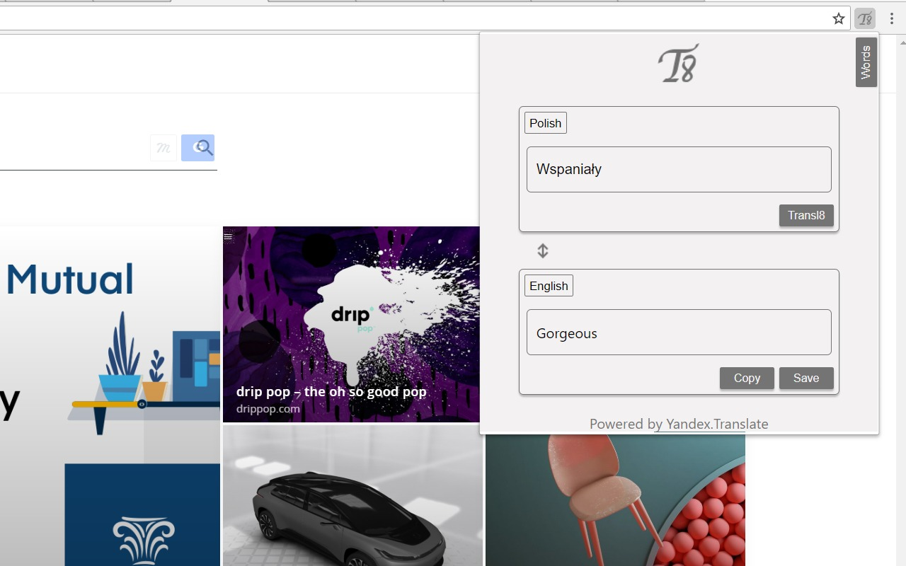
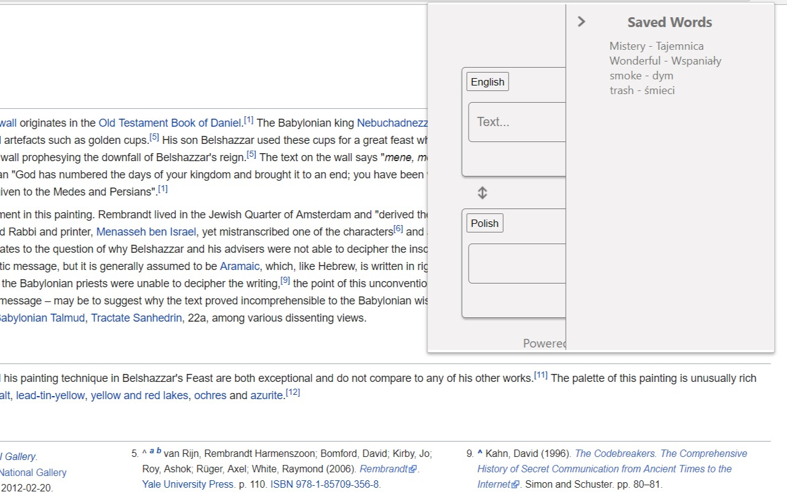
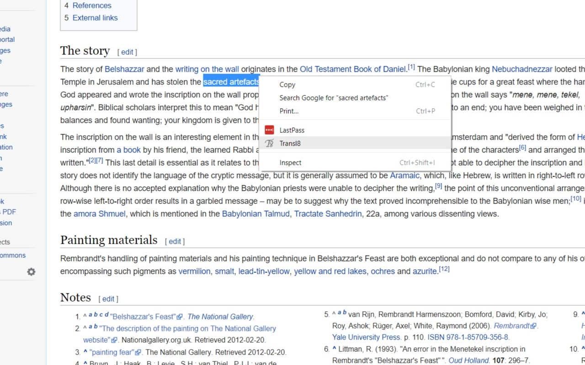
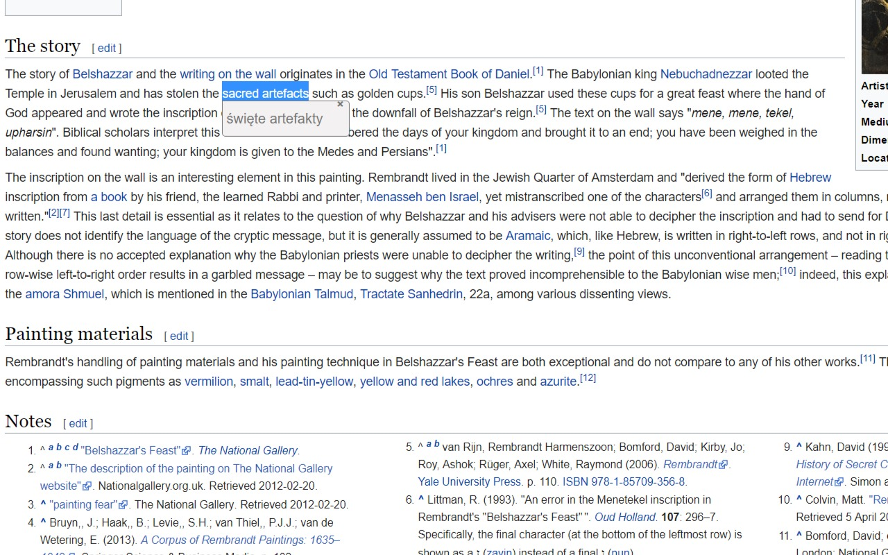

# Transl8

Chrome extension used for translating selected text on web pages.

[Link to Extension in Chrome Webstore](https://chrome.google.com/webstore/detail/transl8/mnebglacodfobomdkcmagajkhalkodjb?hl=pl)

## Technologies used:

- Vanilla JavaScript
- Sass 
- Gulp
- external API - [Yandex Translate](https://tech.yandex.com/translate/)

## Overview:

- Opened Extension from popup
  

- Showing saved words
  

- Selecting text to translate
 

- Getting translation of selected text
  